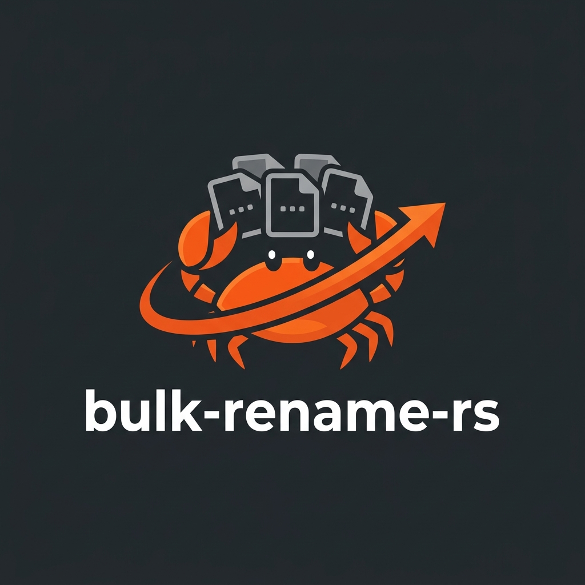

# bulk-rename-rs



[](https://opensource.org/licenses/Apache-2.0)
[](https://github.com/fredyw/bulk-rename-rs/actions/workflows/ci.yml)
[](https://github.com/fredyw/bulk-rename-rs/actions/workflows/publish.yml)
[](https://crates.io/crates/bulk-rename-rs)

A powerful command-line tool for bulk renaming files using regular expressions, built with Rust for speed and safety.

## Table of Contents

- [Installation](#installation)
- [Quick Start](#quick-start)
- [Usage](#usage)
    - [CLI Reference](#cli-reference)
    - [Library API](#library-api)
        - [Basic Usage](#basic-usage)
        - [Custom Callback & Transactional Rollback](#custom-callback--transactional-rollback)
        - [Dry Run (Plan Generation)](#dry-run-plan-generation)
- [Features](#features)
    - [Dynamic Variables](#dynamic-variables)
    - [Text Transformations](#text-transformations)
    - [Collision Handling](#collision-handling)
    - [Transactional Renames](#transactional-renames)
    - [Filtering & Modes](#filtering--modes)
- [Development](#development)
    - [Building](#building)
    - [Testing](#testing)
    - [Releasing](#releasing)
- [Contributing](#contributing)
- [License](#license)

---

## Installation

### From Prebuilt Binaries

**Linux & macOS:**

```bash
curl -fsSL https://raw.githubusercontent.com/fredyw/bulk-rename-rs/main/install.sh | bash
```

**Windows (PowerShell):**

```powershell
iwr -useb https://raw.githubusercontent.com/fredyw/bulk-rename-rs/main/install.ps1 | iex
```

### From crates.io

If you have Rust installed, you can install `bren` directly from [crates.io](https://crates.io/crates/bulk-rename-rs):

```bash
cargo install bulk-rename-rs
```

### From Source

```bash
git clone https://github.com/fredyw/bulk-rename-rs.git
cd bulk-rename-rs
./install.sh --source
```

---

## Quick Start

Get started with common renaming tasks:

### Basic Regex Rename
Rename all `.txt` files by adding a prefix:
```bash
bren -f . -r "(.*)\.txt" -p "prefix_$1.txt"
```

### Add a Sequential Counter
Rename files to `image_001.jpg`, `image_002.jpg`, etc.:
```bash
bren -f ./photos -r ".*\.jpg" -p "image_{i:3}.jpg"
```

### Case Transformation
Convert all filenames to uppercase:
```bash
bren -f . -r "(.*)" -p "{u:$1}"
```

### Dry Run (Safety First)
Preview changes without applying them:
```bash
bren -f . -r "old" -p "new" --dry-run
```

---

## Usage

### CLI Reference

```bash
Usage: bren [OPTIONS] --dir <DIR>
       bren [OPTIONS] --dir <DIR> --regex <REGEX> --replacement <REPLACEMENT>
       bren --undo [OPTIONS]

Options:
  -f, --dir <DIR>                  Set the directory
  -r, --regex <REGEX>              Set the regex (required unless --undo is present)
  -p, --replacement <REPLACEMENT>  Set the replacement (required unless --undo is present)
  -d, --dry-run                    Perform a dry-run
  -q, --quiet                      Run in quiet mode
  -i, --interactive                Prompt for confirmation before each rename
  -I, --ignore-case                Use case-insensitive matching
  -e, --ext <EXT>                  Filter files by extension (comma-separated)
      --include <INCLUDE>          Include only files matching these patterns (comma-separated)
      --exclude <EXCLUDE>          Exclude files matching these patterns (comma-separated)
      --max-depth <MAX_DEPTH>      Set the maximum depth for recursion (1 for current directory only)
  -c, --collision <STRATEGY>       Set the collision strategy [default: skip] [possible values: skip, overwrite, suffix]
      --undo                       Undo the previous rename operation
      --history-file <PATH>        Set the history file path [default: .bren-undo.json]
      --counter-start <START>      Set the starting value for the counter {i} [default: 1]
  -m, --mode <MODE>                Set the renaming mode [default: files] [possible values: files, dirs, all]
  -s, --symlinks <STRATEGY>        Set the symlink strategy [default: ignore] [possible values: ignore, rename, follow]
  -T, --transaction <STRATEGY>     Set the transaction strategy [default: continue] [possible values: continue, abort, rollback]
      --python-script <SCRIPT>     Inline Python script for custom renaming logic
      --python-file <PATH>         Python script file for custom renaming logic
  -h, --help                       Print help
  -V, --version                    Print version
```

### Library API

`bulk-rename-rs` can be integrated into your Rust projects. Add it to your `Cargo.toml`:

```toml
[dependencies]
bulk-rename-rs = "..." # See crates.io badge above for the latest version
```

#### Basic Usage
```rust
use bulk_rename_rs::{BulkRename, NoOpCallback};
use std::path::Path;

fn main() -> Result<(), Box<dyn std::error::Error>> {
    let bulk_rename = BulkRename::new(
        Path::new("./photos"), 
        r"IMG_(\d+)", 
        r"Holiday_$1"
    )?
    .with_rename_files(true)
    .with_rename_dirs(false);
    
    // Execute with no output
    bulk_rename.execute(NoOpCallback::new());
    Ok(())
}
```

#### Custom Callback & Transactional Rollback
You can implement the `Callback` trait to track progress or log errors. This example also demonstrates the `rollback` strategy, which reverts changes if an error occurs mid-process.

```rust
use bulk_rename_rs::{BulkRename, Callback, TransactionStrategy, CollisionStrategy};
use std::path::Path;
use std::io;

struct RenameLogger;

impl Callback for RenameLogger {
    fn on_ok(&mut self, old: &Path, new: &Path) {
        println!("Success: {} -> {}", old.display(), new.display());
    }
    fn on_error(&mut self, old: &Path, new: &Path, err: io::Error) {
        eprintln!("Error renaming {}: {}", old.display(), err);
    }
    fn on_rollback_ok(&mut self, old: &Path, new: &Path) {
        println!("Rolled back: {} -> {}", old.display(), new.display());
    }
    fn on_rollback_error(&mut self, old: &Path, new: &Path, err: io::Error) {
        eprintln!("Rollback failed for {}: {}", old.display(), err);
    }
}

fn main() -> Result<(), Box<dyn std::error::Error>> {
    let engine = BulkRename::new(Path::new("./data"), r"(.*)\.tmp", r"$1.dat")?
        .with_collision_strategy(CollisionStrategy::Suffix)
        .with_transaction_strategy(TransactionStrategy::Rollback);

    engine.execute(RenameLogger);
    Ok(())
}
```

#### Dry Run (Plan Generation)
If you want to preview changes without touching the filesystem, use the `run` method.

```rust
use bulk_rename_rs::BulkRename;
use std::path::Path;

fn main() -> Result<(), Box<dyn std::error::Error>> {
    let engine = BulkRename::new(Path::new("."), r"v(\d+)", r"Version_$1")?;

    println!("Planned changes:");
    engine.run(|old, new| {
        println!("  {} will become {}", old.display(), new.display());
    });

    Ok(())
}
```

---

## Features

### Dynamic Variables
Inject dynamic metadata into your filenames:
- `{i}`: Auto-incrementing counter.
- `{i:N}`: Counter with zero-padding (e.g., `{i:3}` -> `001`).
- `{date}`: File modification date (`YYYY-MM-DD`).
- `{date:FORMAT}`: Custom date format (e.g., `{date:%Y%m%d}`).

**Example:**
```bash
# Rename to: 2023-10-27_001.log
bren -f . -r ".*\.log" -p "{date}_{i:3}.log"
```

### Text Transformations
Apply transformations to capture groups or static text:
- `{u:TEXT}` / `{upper:TEXT}`: UPPERCASE
- `{l:TEXT}` / `{lower:TEXT}`: lowercase
- `{t:TEXT}` / `{title:TEXT}`: Title Case

**Example:**
```bash
# Matches "report_final.doc" -> "REPORT_Final.doc"
bren -f . -r "(.*)_(.*)\.doc" -p "{u:$1}_{t:$2}.doc"
```

### Collision Handling
Control what happens when a target filename already exists:
- `skip` (default): Skip the file.
- `overwrite`: Overwrite the existing file.
- `suffix`: Append a numeric suffix (e.g., `file (1).txt`).

### Transactional Renames
Ensure consistency during bulk operations:
- `continue` (default): Skip errors and keep going.
- `abort`: Stop on the first error.
- `rollback`: Stop and undo all successful renames from the current session if an error occurs.

### Filtering & Modes
- **File Types**: Filter by extension (`--ext jpg,png`).
- **Path Filtering**: Use `--include` and `--exclude` regex patterns.
- **Recursion**: Control depth with `--max-depth`.
- **Modes**: Rename `files`, `dirs`, or `all`.
- **Symlinks**: Choose to `ignore`, `rename` the link, or `follow` to the target.

### Scriptable Renaming (Python)
For complex logic, you can use embedded Python scripting. This feature is self-contained and does not require a local Python installation.

Your script (whether inline or from a file) must set the `result` variable to the desired new filename.

**Available Variables:**
- `name`: The current filename.
- `path`: The full path to the file.

**Examples:**
```bash
# Inline snippet: uppercase
bren -f . --python-script "result = name.upper()"

# Inline snippet: regex substitution
bren -f . --python-script "import re; result = re.sub(r'\d+', '', name)"

# Loading from a file
# File: my_logic.py
# result = name.replace(' ', '_').lower()
bren -f . --python-file my_logic.py
```

---

## Development

### Building

To build the project, you need to have Rust installed. You can install it from [here](https://www.rust-lang.org/tools/install).

Once you have Rust installed, you can build the project by running the following command:

```bash
./build.sh --release
```

The binary will be located in `target/release/bren`.

### Testing

To run the tests, including formatting and linting checks, you can use the following command:

```bash
./test.sh
```

### Releasing

To create a new release, use the provided `release.sh` script:

```bash
./release.sh <version>
```

Example:
```bash
./release.sh 0.1.0
```

---

## Contributing

Contributions are welcome! 

### AI Agents
If you are an **AI Agent** contributing to this repository, please read **[AGENTS.md](AGENTS.md)** before making any changes. It contains specific rules and workflows designed for agentic contributions.

## License

This project is licensed under the Apache License 2.0. See the [LICENSE](LICENSE) file for details.
